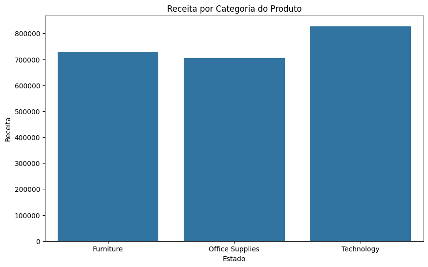
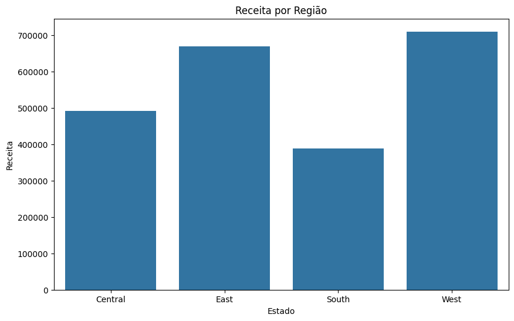
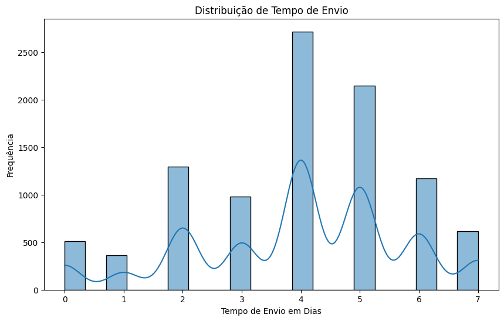
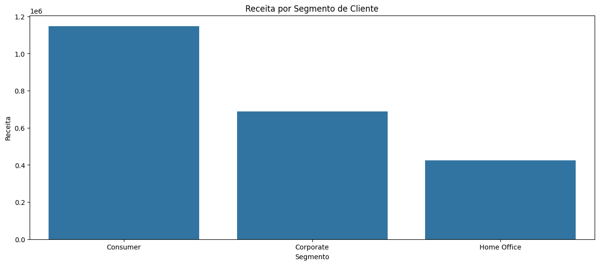

# Análise de Dados

## Descrição do Projeto 
Este projeto se consiste em uma análise de dados sobre a base de dados "Superstore Sales Dataset" encontrada na plataforma Kaggle, visando compreender ps padrões de vendas, tempos de envios e se identificar os insights relevantes para a tomada de decisões, otimização e estratégias de mercado.

## Objetivo
Esta análise de dados foi desenvolvida com o foco em fornecer insights relevantes sobre diferentes áreas de atuação da empresa, visando otimizar o desempenho em vendas, marketing e operações logísticas. A partir da exploração dos dados, foi buscado identificar tendências e comportamentos que possam ser utilizados para apoiar a tomada de decisões empresariais em diversos níveis.
A análise concentrou-se nos principais aspectos:
- Receita por Categoria de Produto: Foi avaliado quais categorias de produtos são as mais lucrativas, observando o impacto de cada uma na receita geral. Esta análise auxilia a identificar oportunidade de investimento e crescimento em categorias específicas.
- Distribuição do Tempo de Envio: Foi analisado o tempo médio de envio dos pedidos realizados, revelando assim padrões e possíveis atrasos que possam afetar a eficiência logística e a satisfação final do cliente.
-Segmentação de Clientes: Foi observado o comportamento de distintos segmentos de clientes (Consumer, Corporate e Home Office), revelando assim quais segmentos geram mais receita e como estratégias de marketing possam ser aplicas para melhorar os resultados de cada segmento.

## Principais Insights
## 1. Receita por Categoria

A análise da receita por categoria de produto mostra que a categoria Technology gera a maior receita, possindo um total de mais de 800.000, seguida por Furniture e Office Supplies, possuindo receitas próximas, ambas ligeiramente abaixo de 750.000.
Os resultados indicam:
- Os produtos de tecnologia são os mais lucrativos, indicando uma maior demanda ou preços elevadis nesse segmento. Podendo sugerir relevância de continuar investindo nessa categoria de produtos.
- Furniture (Mobiliário) e Office Supplies (Suplementos de Escritório) também contribuem significativamente para a receita, desmonstrando assim que essas categorias são essenciais, mesmo que apresentam receitas ligeiramente menores em relação a Technology (Tecnologia).
- O aperfeiçoamento da estratégia comercial pode beneficiar todas as categorias, possuindo um foco maior na categoria Technology (Tecnologia), possivelmente expandindo seu portifólio e as promoções para impulsionar as vendas nessa categoria.

## 2. Receita por Região

A análise de receita por região demonstra que a região West(Oeste) é que mais gerou renda, possuindo um total superior a 700.000, seguido pela região East(Leste) possuindo uma receita significativa ultrapassando 650.00. As regiões Central e South(Sul) apresentam receita inferiores, gerando respectivamente 500.000 e 450.000.
Os resultados indicam:
- As regiões West(Oeste) e East(Leste) são as regiões mais lucrativas, o que sugere uma maior concentração de mercado ou uma elevada demanda de produtos nessas áreas. Torna-se interessante a exploração e criação de novas estratégias de marketing e vendas nessas regiões com o intuito de aompliar a receita continuamente.
- As regiões Central e South(Sul) embora gerem menos receita, ainda possuem uma contribuição relevante. Com estratégias específicas para melhorar o desempenho nessas regiões podem auxiliar a equilibrar o crescimento entre todas as regiões.
- Aumentar os investimentos nas regiões que possuem menor desempenho pode aumentar a regeita geral, enquanto a expansão da presença em regiões mais lucrativas pode consolidar a liderança de mercado.

## 3. Tempo de Entrega

A análise da distribuição de tempo de envio mostra que grande parte dos pedidos são entregues entre 2 a 5 dias, possuindo picos relevantes de frequência nos dias 4 a 5. Poucos pedidos são entregues no mesmo dia ou em 1 dia, apontando que não é recorrente que haja a entrega rápida. A redução na frequência de entregas para 6 a 7 dias aponta que ocorrem demoras venham a ocorres porém são menos frequentes
Os resultados indicam:
- O tempo de entrega padrão fica em torno de 4 a 5 dias. Para a maioria dos clientes este prazo pode ser considerado um tempo esperado para uma entrega.
- Há oportunidades para a otimização no processo de envio, principalmente se a redução do tempo de envior ser uma prioridade. Aperfeiçoar a  eficiência pode resultar em mais entregas em menos de 3 dias.
- Entregas expressas pode ser uma área a ser mais explorada, pois é quantidade de entregas realizadas em 0 ou 1 dia é baixa, possivelmente indicando uma demanda menor ou uma oportunidade para a expanção desse serviço.

## 4. Segmentação de Clientes

A análise sobre a receita gerada pelos segmentos de clientes, mostra que o segmento mais lucrativo é o Consumer (Consumidor) gerando uma receita superior aos demais segmentos. O segmento que mais gera receita em seguida é o Corporate (Empresarial) e o segmentos que possui a menor receita dentre eles é o segmento Home Office.
Essa distribuição de receita indica que:
- Estratégias de marketing direcionadas ao segmento COnsumer poder ser mais exploradas, visto que é o segmento que possui um forte retorno.
- O segmento Corporate apresenta grande potencial de expansão, principalmente tendo foco em parcerias e serviços especializados.
- O segmento Home Office, mesmo possuindo a menor receita, ainda pode ser relevante para produtos e serviços específicos, e estratégias voltadas para esse público podem arretar em um aumento da sua participação na receita

